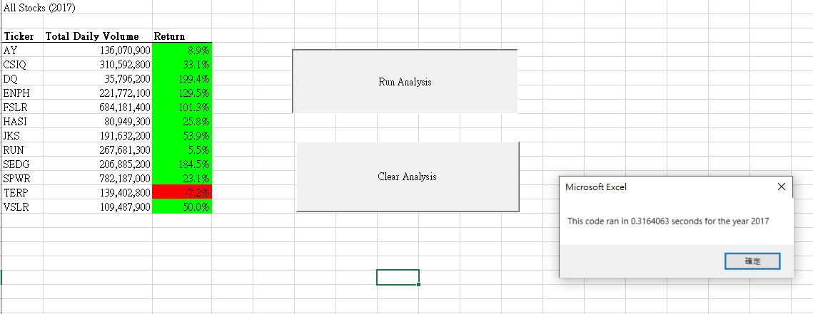
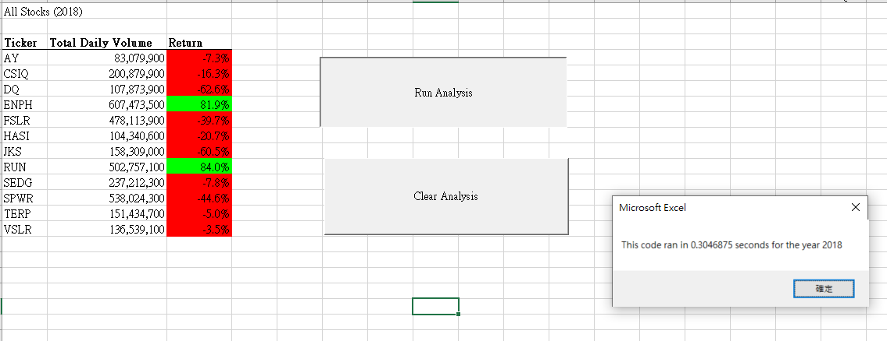
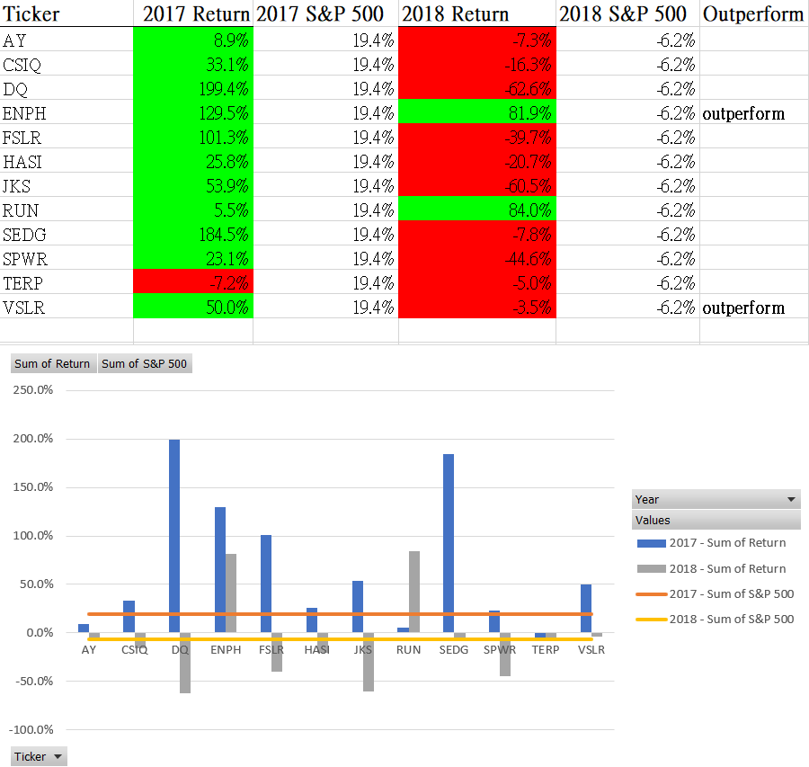

# Stock-analysis
Performing stock analysis on 12 stocks to compare their trading volume and rate of return in 2017 and 2018
## Overview of Project
-Steve would like to find out what are the best performing green stocks for his parents by going through all the traing days in 2017 and 2018, and calculating the stock trading volumes and rate of return for 12 stocks.\
-Steve is looking to expand the dataset to include the entire stock market over the last few years so he would like us to regractor the code in order to run the code in a more time efficient way.

## Result
The analysis is well described with screenshots and code (4 pt).
### Stock Analysis 2017
VBA script was written to extract the data from worksheet 2017 and total daily volume and rate of return were calculated for 12 stocks. Stocks with positive rate of return were then highlighted in green where those with negative ROI were highlighted in red. I then compared the ROI of all 12 stocks with ROI of S&P 500 in 2017 to determine which ones outperform the benchmark. 
### VBA Script 2017
Original VBA script took 0.9375 seconds to run while the regractored script took only 0.3164 seconds. This was due to the creation of the three output arrays; tickerVolumes, tickerStartingPrice and tickerEndingPrice. As a result, system was able to go through just one big loop to categorize the data for each stock instead of going through all the rows for 12 times.
\
-Running time for original script
\
-Running time for refractored script
### Stock Analysis 2018
Original VBA script took 0.8594 seconds to run while the regractored script took only 0.3047 seconds.

### Outperform Stocks in both 2017 and 2018
To conclude, only 2 stocks outperformed S&P500 in both years which are ENPH and VSLR. The rate of return of all 12 stocks in both years were compiled using pivot table to derive the below chart and then VBA script was written to pick out the two outperformed stocks.

## Summary
Code refractoring is a way to restructure and optimize your existing design of code without changing its external behaviour. Refractoring has its advantage and disadvantage.

-Advantages: it can enhance exsiting code to make it more efficient and easier for humans to understand. It also increases the maintainability. \
-Disadvantages: it might be time consuming and more costly than rewriting the code from scratch thus making it more risky to do it. In addition, there might be new potential buds that might be introduced with code refractoring.

### Advantages and disadvantages of the original VBA scripts:
The original code is easier to understand for people who are new to VBA since its more straightforward;however, it took much longer to run then the refractored script.
### Advantages and disadvantages of the refractored VBA scripts:
In our project, with the refractored script, it decreases the time to run the program thus enabling Steve to expand the dataset and do more calculation of stocks in future; however, it took more time to actually refractor the code than writing the original code. In additional, more arrays were needed so its harder to understand.

